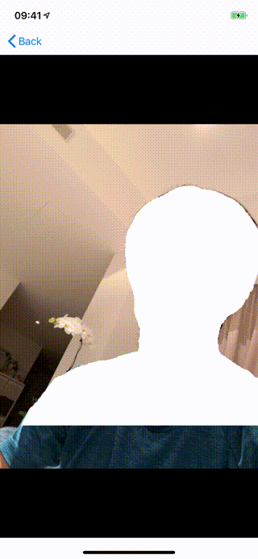
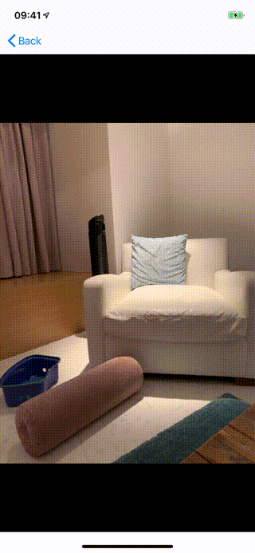
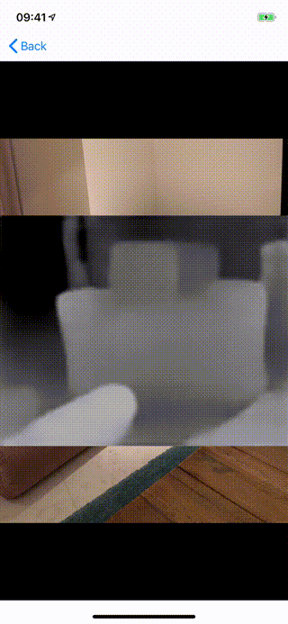

# VisionCoreMLSamples

__NOTE : You will need to install [git-lfs](https://git-lfs.github.com) before cloning this repository by `brew install git-lfs`, in order to get the contents of *.mlmodels that this project is using.__

Implement Vision related CoreML samples. So far, implemented all the models that came up new in 2019. (There is a BERT one, but it is not a Vision sample, so I skipped here.)

### DeepLabV3 example

### YOLOv3 example

Detects everything pretty accurately.

### Tiny YOLOv3 example

Speed is better, but you can see, hand is not detected it

### MRT Depth

